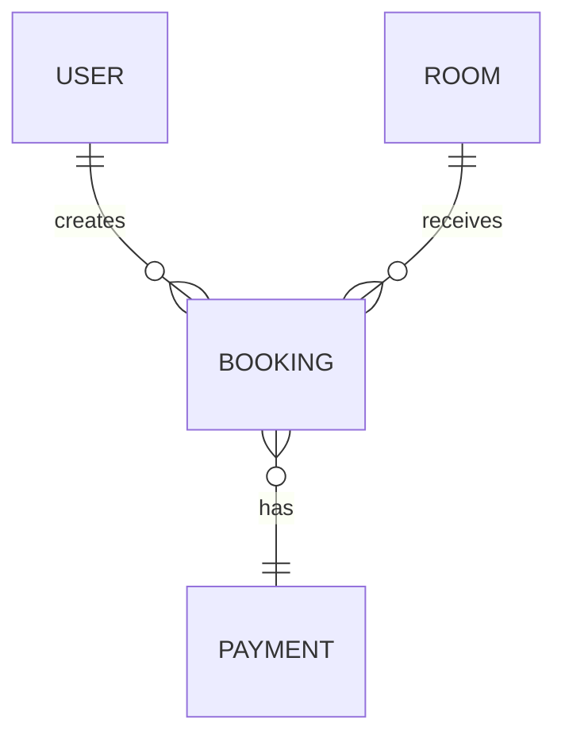

# System Analysis Portfolio

## Core workflow

```text
Problem -> Stakeholders -> Requirements -> Business Process -> Use Case -> DFD -> ERD -> Database -> Prototype
```

## Covered projects

- System Analysis & Design
- Accommodation Booking
- Animal Adoption / GreaterGood-style system
- Energy Drink Vending System
- IoT Automated Clothesline

## Common analysis artifacts

### Functional requirements
- User registration/login where required
- Search and filtering
- CRUD operations
- Transaction/booking workflows
- Status tracking
- Notifications or confirmations

### Data model example



### BA value

The projects demonstrate requirements analysis, process modeling, business rules, data modeling, documentation and communication between business and technical perspectives.
